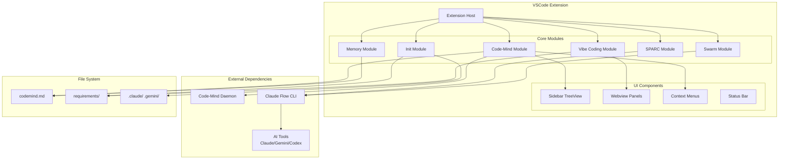

# Inkstone-Init 系統設計文件

> 版本: 1.0.0
> 日期: 2024-12-24
> 狀態: Draft

---

## 1. 概述

Inkstone 是一個統一的 VSCode Extension，整合 Code-Mind 筆記系統、專案初始化、Vibe Coding 工作流程、記憶管理、SPARC 開發模式和 Swarm 協調功能。目標是讓 Vibe Coder 能夠透過簡單的按鈕操作完成複雜的 AI 輔助開發任務。

### 1.1 設計原則

1. **簡單優先**: 所有功能都可透過 UI 按鈕操作，無需記憶終端指令
2. **漸進式複雜度**: 進階用戶可使用終端指令獲得更多控制
3. **純文字優先**: 使用 Markdown 檔案（`codemind.md`）而非資料庫
4. **模組化設計**: 各功能模組獨立，可個別載入或停用

---

## 2. 系統架構

### 2.1 高層架構圖



### 2.2 目錄結構

```
inkstone-vscode/
├── src/
│   ├── extension.ts              # Extension 入口
│   ├── core/
│   │   ├── codemind/            # Code-Mind 筆記模組
│   │   │   ├── daemon.ts        # Daemon 管理
│   │   │   ├── notes.ts         # 筆記 CRUD
│   │   │   ├── parser.ts        # Markdown 解析
│   │   │   └── linker.ts        # 連結管理
│   │   ├── init/                # 專案初始化模組
│   │   │   ├── scaffold.ts      # 目錄結構生成
│   │   │   ├── templates/       # 設定檔模板
│   │   │   └── hooks.ts         # Hooks 配置
│   │   ├── vibe-coding/         # Vibe Coding 模組
│   │   │   ├── workflow.ts      # 工作流程管理
│   │   │   ├── stages/          # 各階段邏輯
│   │   │   └── generators/      # 文件生成器
│   │   ├── memory/              # 記憶管理模組
│   │   │   ├── store.ts         # 記憶儲存
│   │   │   └── restore.ts       # 記憶恢復
│   │   ├── sparc/               # SPARC 模組
│   │   │   └── modes.ts         # 各種開發模式
│   │   └── swarm/               # Swarm 模組
│   │       ├── init.ts          # Swarm 初始化
│   │       └── monitor.ts       # 狀態監控
│   ├── ui/
│   │   ├── sidebar/             # 側邊欄 TreeView
│   │   │   ├── provider.ts
│   │   │   └── items.ts
│   │   ├── webview/             # Webview 面板
│   │   │   ├── vibe-coding/
│   │   │   └── swarm-status/
│   │   ├── context-menu/        # 右鍵選單
│   │   └── status-bar/          # 狀態列
│   └── utils/
│       ├── terminal.ts          # 終端指令執行
│       ├── config.ts            # 設定管理
│       └── notifications.ts     # 通知系統
├── templates/                    # 初始化模板檔案
│   ├── claude/
│   ├── gemini/
│   └── codex/
├── webview-ui/                   # Webview 前端 (React)
│   ├── vibe-coding/
│   └── swarm-status/
└── package.json
```

---

## 3. 元件設計

### 3.1 Extension 入口

```typescript
// src/extension.ts
import * as vscode from 'vscode';
import { CodeMindModule } from './core/codemind';
import { InitModule } from './core/init';
import { VibeCodingModule } from './core/vibe-coding';
import { MemoryModule } from './core/memory';
import { SparcModule } from './core/sparc';
import { SwarmModule } from './core/swarm';
import { SidebarProvider } from './ui/sidebar/provider';

export async function activate(context: vscode.ExtensionContext) {
    // 初始化各模組
    const modules = {
        codemind: new CodeMindModule(context),
        init: new InitModule(context),
        vibeCoding: new VibeCodingModule(context),
        memory: new MemoryModule(context),
        sparc: new SparcModule(context),
        swarm: new SwarmModule(context),
    };

    // 載入模組，失敗不影響其他模組
    for (const [name, module] of Object.entries(modules)) {
        try {
            await module.activate();
        } catch (error) {
            vscode.window.showErrorMessage(
                `Inkstone: Failed to load ${name} module`
            );
        }
    }

    // 註冊 Sidebar
    const sidebarProvider = new SidebarProvider(modules);
    vscode.window.registerTreeDataProvider('inkstone-sidebar', sidebarProvider);

    // 顯示歡迎訊息（首次安裝）
    if (!context.globalState.get('inkstone.welcomed')) {
        vscode.window.showInformationMessage(
            'Welcome to Inkstone! Click the Inkstone icon in the sidebar to get started.'
        );
        context.globalState.update('inkstone.welcomed', true);
    }
}
```

### 3.2 Code-Mind 模組

```typescript
// src/core/codemind/index.ts
export interface Note {
    id: string;           // cm.xxxxxx
    title: string;
    content: string;
    file: string;
    line: number;
    author: 'human' | 'ai';
    created: Date;
    type?: 'note' | 'memory';
    backlinks: string[];
}

export interface NoteStore {
    getAll(): Note[];
    getById(id: string): Note | undefined;
    getByFile(file: string): Note[];
    getByType(type: string): Note[];
    add(note: Omit<Note, 'id'>): Note;
    update(id: string, updates: Partial<Note>): void;
    delete(id: string): void;
    search(query: string): Note[];
    save(): Promise<void>;
    reload(): Promise<void>;
}

export class CodeMindModule {
    private store: NoteStore;
    private daemon: DaemonManager;

    async activate() {
        // 載入筆記
        this.store = await createNoteStore();

        // 註冊右鍵選單
        this.registerContextMenu();

        // 註冊自動補全
        this.registerCompletion();

        // 註冊定義跳轉
        this.registerDefinitionProvider();

        // 確保 Daemon 運行
        this.daemon = new DaemonManager();
    }

    private registerContextMenu() {
        vscode.commands.registerCommand('inkstone.addNote', async () => {
            const editor = vscode.window.activeTextEditor;
            if (!editor) return;

            const selection = editor.selection;
            const selectedText = editor.document.getText(selection);

            const title = await vscode.window.showInputBox({
                prompt: 'Enter note title',
                value: selectedText.slice(0, 50),
            });

            if (!title) return;

            // 確保 Daemon 運行
            await this.daemon.ensureRunning();

            // 建立筆記
            const note = this.store.add({
                title,
                content: selectedText,
                file: editor.document.fileName,
                line: selection.start.line,
                author: 'human',
                created: new Date(),
            });

            // 插入引用
            editor.edit(editBuilder => {
                editBuilder.replace(
                    selection,
                    `[[${note.id}|${title}]]`
                );
            });

            await this.store.save();
            vscode.window.showInformationMessage(`Note created: ${note.id}`);
        });
    }
}
```

### 3.3 Daemon 管理

```typescript
// src/core/codemind/daemon.ts
export class DaemonManager {
    private isRunning: boolean = false;
    private statusBarItem: vscode.StatusBarItem;

    constructor() {
        this.statusBarItem = vscode.window.createStatusBarItem(
            vscode.StatusBarAlignment.Right,
            100
        );
    }

    async ensureRunning(): Promise<void> {
        if (this.isRunning) return;

        const isAlive = await this.checkDaemon();
        if (isAlive) {
            this.isRunning = true;
            this.updateStatusBar(true);
            return;
        }

        await this.startDaemon();
    }

    private async checkDaemon(): Promise<boolean> {
        try {
            const result = await execCommand('pgrep -f "codemind daemon"');
            return result.trim().length > 0;
        } catch {
            return false;
        }
    }

    private async startDaemon(): Promise<void> {
        try {
            // 在背景啟動 Daemon
            execCommand('npx codemind daemon start', { background: true });

            // 等待 Daemon 就緒
            await this.waitForDaemon();

            this.isRunning = true;
            this.updateStatusBar(true);
        } catch (error) {
            vscode.window.showErrorMessage('Failed to start Code-Mind Daemon');
        }
    }

    private updateStatusBar(running: boolean) {
        if (running) {
            this.statusBarItem.text = '$(database) Code-Mind';
            this.statusBarItem.tooltip = 'Code-Mind Daemon is running';
            this.statusBarItem.backgroundColor = undefined;
        } else {
            this.statusBarItem.text = '$(warning) Code-Mind';
            this.statusBarItem.tooltip = 'Code-Mind Daemon is not running';
            this.statusBarItem.backgroundColor = new vscode.ThemeColor(
                'statusBarItem.warningBackground'
            );
        }
        this.statusBarItem.show();
    }
}
```

### 3.4 Sidebar TreeView

```typescript
// src/ui/sidebar/provider.ts
export class SidebarProvider implements vscode.TreeDataProvider<SidebarItem> {
    private _onDidChangeTreeData = new vscode.EventEmitter<SidebarItem | undefined>();
    readonly onDidChangeTreeData = this._onDidChangeTreeData.event;

    constructor(private modules: ModuleMap) {}

    getTreeItem(element: SidebarItem): vscode.TreeItem {
        return element;
    }

    getChildren(element?: SidebarItem): SidebarItem[] {
        if (!element) {
            // 根節點 - 顯示所有功能區塊
            return [
                new SidebarItem('Notes', 'notes', vscode.TreeItemCollapsibleState.Collapsed),
                new SidebarItem('Memory', 'memory', vscode.TreeItemCollapsibleState.Collapsed),
                new SidebarItem('SPARC', 'sparc', vscode.TreeItemCollapsibleState.Collapsed),
                new SidebarItem('Swarm', 'swarm', vscode.TreeItemCollapsibleState.Collapsed),
                new SidebarItem('Vibe Coding', 'vibe-coding', vscode.TreeItemCollapsibleState.None),
            ];
        }

        // 子節點 - 顯示功能按鈕
        switch (element.contextValue) {
            case 'notes':
                return this.getNotesChildren();
            case 'memory':
                return this.getMemoryChildren();
            case 'sparc':
                return this.getSparcChildren();
            case 'swarm':
                return this.getSwarmChildren();
            default:
                return [];
        }
    }

    private getMemoryChildren(): SidebarItem[] {
        return [
            new ActionItem('Save Memory', 'inkstone.saveMemory', '$(save)'),
            new ActionItem('Restore Memory', 'inkstone.restoreMemory', '$(history)'),
            new ActionItem('Search Memory', 'inkstone.searchMemory', '$(search)'),
        ];
    }

    private getSparcChildren(): SidebarItem[] {
        return [
            new ActionItem('Architect', 'inkstone.sparc.architect', '$(symbol-structure)'),
            new ActionItem('Coder', 'inkstone.sparc.coder', '$(code)'),
            new ActionItem('TDD', 'inkstone.sparc.tdd', '$(beaker)'),
            new ActionItem('More...', 'inkstone.sparc.more', '$(ellipsis)'),
        ];
    }

    private getSwarmChildren(): SidebarItem[] {
        return [
            new ActionItem('Init Swarm', 'inkstone.swarm.init', '$(rocket)'),
            new ActionItem('View Status', 'inkstone.swarm.status', '$(pulse)'),
        ];
    }
}
```

### 3.5 Vibe Coding Webview

```typescript
// src/core/vibe-coding/workflow.ts
export interface WorkflowState {
    currentStage: number;
    stages: StageStatus[];
    projectPath: string;
}

export enum StageStatus {
    Pending = 'pending',
    InProgress = 'in-progress',
    Completed = 'completed',
}

export class VibeCodingModule {
    private panel: vscode.WebviewPanel | undefined;
    private state: WorkflowState;

    async activate() {
        vscode.commands.registerCommand('inkstone.startVibeCoding', () => {
            this.openPanel();
        });
    }

    private openPanel() {
        if (this.panel) {
            this.panel.reveal();
            return;
        }

        this.panel = vscode.window.createWebviewPanel(
            'vibeCoding',
            'Vibe Coding',
            vscode.ViewColumn.One,
            {
                enableScripts: true,
                retainContextWhenHidden: true,
            }
        );

        this.panel.webview.html = this.getWebviewContent();

        // 處理 Webview 訊息
        this.panel.webview.onDidReceiveMessage(async message => {
            switch (message.command) {
                case 'nextStage':
                    await this.processNextStage();
                    break;
                case 'goToStage':
                    await this.goToStage(message.stage);
                    break;
            }
        });

        // 檢測現有進度
        this.detectProgress();
    }

    private async detectProgress() {
        const workspaceFolder = vscode.workspace.workspaceFolders?.[0];
        if (!workspaceFolder) return;

        const basePath = workspaceFolder.uri.fsPath;

        // 檢查各階段文件
        const files = {
            initialRequirements: `${basePath}/user-requirements/initial-requirements.md`,
            requirements: `${basePath}/rfp/proposal/requirements.md`,
            design: `${basePath}/rfp/proposal/design.md`,
            tasks: `${basePath}/rfp/proposal/tasks.md`,
        };

        // 判斷當前階段
        if (await fileExists(files.tasks)) {
            this.state.currentStage = 5; // 已完成
        } else if (await fileExists(files.design)) {
            this.state.currentStage = 5; // 階段 5
        } else if (await fileExists(files.requirements)) {
            this.state.currentStage = 4; // 階段 4
        } else if (await fileExists(files.initialRequirements)) {
            this.state.currentStage = 2; // 階段 2
        } else {
            this.state.currentStage = 1; // 階段 1
        }

        this.updateWebview();
    }
}
```

---

## 4. 資料模型

### 4.1 codemind.md 格式

```markdown
# Code-Mind Notes
- Project: my-project
- Created: 2024-12-24
- ## src/auth.ts
  - [[cm.abc123]] 用戶認證邏輯
    - human · 2024-12-24 · line 42
    - 需要重構以支援 OAuth
    - [[cm.def456]] OAuth 支援
      - ai · 2024-12-24
      - 建議使用 Passport.js
- ## memory
  - [[cm.mem001]] 架構決策
    - human · 2024-12-24 · type:memory
    - 使用微服務架構，API Gateway + 3 個服務
```

### 4.2 目錄結構模板

```
requirements/
├── initial/
│   ├── rfp/
│   │   ├── README.md           # 用戶需求說明
│   │   └── Gherkin/
│   │       └── feature-1.feature
│   └── proposal/
│       ├── requirements.md     # Epics/Stories/EARS
│       ├── design.md          # 系統設計
│       └── tasks.md           # 任務分解
└── feature-xxx/               # 後續新需求
    ├── rfp/
    └── proposal/
```

---

## 5. 錯誤處理

### 5.1 策略

```typescript
// src/utils/error-handler.ts
export class InkstoneError extends Error {
    constructor(
        message: string,
        public readonly code: ErrorCode,
        public readonly recoverable: boolean = true
    ) {
        super(message);
    }
}

export enum ErrorCode {
    DaemonNotRunning = 'DAEMON_NOT_RUNNING',
    FileNotFound = 'FILE_NOT_FOUND',
    ParseError = 'PARSE_ERROR',
    CommandFailed = 'COMMAND_FAILED',
}

export async function withErrorHandling<T>(
    operation: () => Promise<T>,
    context: string
): Promise<T | undefined> {
    try {
        return await operation();
    } catch (error) {
        if (error instanceof InkstoneError) {
            if (error.recoverable) {
                vscode.window.showWarningMessage(
                    `${context}: ${error.message}`
                );
            } else {
                vscode.window.showErrorMessage(
                    `${context}: ${error.message}`
                );
            }
        } else {
            vscode.window.showErrorMessage(
                `${context}: Unexpected error occurred`
            );
            console.error(error);
        }
        return undefined;
    }
}
```

---

## 6. 測試策略

### 6.1 單元測試

```typescript
// src/core/codemind/__tests__/notes.test.ts
import { describe, it, expect } from 'vitest';
import { createNoteStore } from '../notes';

describe('NoteStore', () => {
    it('should create note with unique ID', async () => {
        const store = await createNoteStore();
        const note = store.add({
            title: 'Test Note',
            content: 'Content',
            file: 'test.ts',
            line: 1,
            author: 'human',
            created: new Date(),
        });

        expect(note.id).toMatch(/^cm\.[a-z0-9]{6}$/);
    });

    it('should search notes by content', () => {
        const store = createMockStore([
            { id: 'cm.aaa111', title: 'Auth', content: 'Authentication' },
            { id: 'cm.bbb222', title: 'DB', content: 'Database' },
        ]);

        const results = store.search('auth');
        expect(results).toHaveLength(1);
        expect(results[0].id).toBe('cm.aaa111');
    });
});
```

### 6.2 整合測試

```typescript
// src/__tests__/integration/workflow.test.ts
describe('Vibe Coding Workflow', () => {
    it('should detect existing progress', async () => {
        // 建立測試工作區
        const workspace = await createTestWorkspace();

        // 建立 requirements.md
        await workspace.writeFile(
            'rfp/proposal/requirements.md',
            '# Requirements'
        );

        // 開啟 Vibe Coding
        const module = new VibeCodingModule(context);
        await module.activate();

        // 驗證檢測到階段 4
        expect(module.state.currentStage).toBe(4);
    });
});
```

---

## 7. 效能考量

### 7.1 筆記載入

- **增量載入**: 只載入當前檔案相關的筆記
- **快取**: 記憶體快取已解析的筆記
- **背景同步**: 在背景監聽檔案變更並更新快取

### 7.2 Webview 優化

- **Lazy Loading**: 按需載入 Webview 內容
- **State Persistence**: 保留 Webview 狀態，避免重複渲染
- **Debounce**: 對用戶輸入進行防抖處理

---

## 8. 安全性

### 8.1 考量

1. **終端指令**: 所有執行的終端指令都應驗證輸入，避免注入攻擊
2. **檔案存取**: 限制在工作區目錄內
3. **API 金鑰**: 不在 Extension 中儲存敏感資訊

```typescript
// src/utils/terminal.ts
export async function execCommand(
    command: string,
    options?: ExecOptions
): Promise<string> {
    // 驗證指令
    const allowedCommands = [
        'claude-flow',
        'codemind',
        'pgrep',
        'npx',
    ];

    const baseCommand = command.split(' ')[0];
    if (!allowedCommands.some(c => baseCommand.includes(c))) {
        throw new InkstoneError(
            `Command not allowed: ${baseCommand}`,
            ErrorCode.CommandFailed,
            false
        );
    }

    return execAsync(command, options);
}
```

---

## 9. 部署

### 9.1 發布流程

```yaml
# .github/workflows/publish.yml
name: Publish Extension

on:
  push:
    tags:
      - 'v*'

jobs:
  publish:
    runs-on: ubuntu-latest
    steps:
      - uses: actions/checkout@v4

      - name: Setup Node.js
        uses: actions/setup-node@v4
        with:
          node-version: '20'

      - name: Install dependencies
        run: npm ci

      - name: Build
        run: npm run build

      - name: Test
        run: npm test

      - name: Package
        run: npx vsce package

      - name: Publish to Marketplace
        run: npx vsce publish
        env:
          VSCE_PAT: ${{ secrets.VSCE_PAT }}
```

### 9.2 版本策略

- **Major**: 重大架構變更或破壞性更新
- **Minor**: 新功能
- **Patch**: Bug 修復
