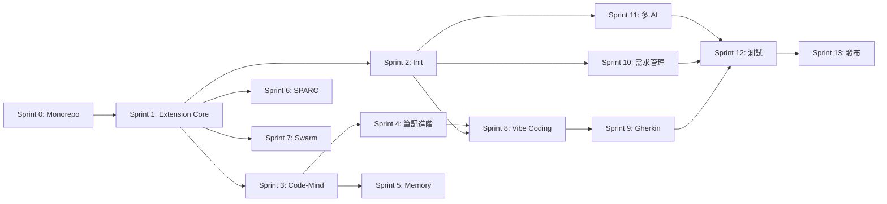

# Inkstone-Init 任務分解清單

> 版本: 1.0.0
> 日期: 2024-12-24
> 狀態: Draft

---

## 開發策略

採用**增量式 Sprint 開發**，每個 Sprint 包含前端 + 後端功能，確保可進行 E2E 測試。

---

## Sprint 0: 專案初始化與基礎架構

**目標**: 建立 Monorepo 結構和開發環境

### 任務 0.1: Monorepo 設置

- [x] **0.1.1 整合 Code-Mind 到專案** ✅ 2024-12-24
  - 移除 `Code-Mind/.git` 目錄
  - 調整 package.json 為 workspace 成員
  - 更新依賴引用路徑（namespace 從 `@uncle6/*` 遷移到 `@inkstone/*`）
  - _需求: 需求 5_

- [x] **0.1.2 建立統一的專案結構** ✅ 2024-12-24
  - 建立 `packages/inkstone-vscode/` 目錄
  - 建立 `packages/codemind-core/` 目錄
  - 配置 npm workspace（5 個 packages）
  - _需求: 6.1_

- [x] **0.1.3 開發環境配置** ✅ 2024-12-24
  - 配置 TypeScript (tsconfig.json)
  - 配置 ESLint + Prettier
  - 配置 Vitest 測試框架
  - 建立 GitHub Actions CI/CD
  - _需求: Story 1.1_

### 測試交付

| 測試項目 | 驗證方式 |
|---------|---------|
| Monorepo 結構 | `npm install` 成功執行 |
| TypeScript 編譯 | `npm run build` 無錯誤 |
| Lint 檢查 | `npm run lint` 通過 |

---

## Sprint 1: Extension 核心與 Sidebar 面板

**目標**: 建立可安裝的 VSCode Extension 和基礎 UI

### 任務 1.1: Extension 入口

- [ ] **1.1.1 建立 Extension Host**
  - 實作 `src/extension.ts` 入口點
  - 定義 activate/deactivate 生命週期
  - 配置 `package.json` contributes
  - _需求: Story 1.1_

- [ ] **1.1.2 模組載入機制**
  - 實作模組化載入架構
  - 處理模組載入失敗的容錯
  - 顯示歡迎訊息（首次安裝）
  - _需求: Story 1.1, Story 1.2_

### 任務 1.2: Sidebar TreeView

- [ ] **1.2.1 建立 TreeView Provider**
  - 實作 `SidebarProvider` 類別
  - 定義根節點（Notes, Memory, SPARC, Swarm, Vibe Coding）
  - 配置圖示和樣式
  - _需求: Story 1.3_

- [ ] **1.2.2 功能按鈕項目**
  - 實作 `ActionItem` 類別
  - 定義各區塊的子按鈕
  - 連結按鈕到對應指令
  - _需求: Story 1.3, Story 6.1_

### 任務 1.3: 基礎指令註冊

- [ ] **1.3.1 註冊 Inkstone 指令**
  - 註冊 `inkstone.initProject` 指令
  - 註冊 `inkstone.startVibeCoding` 指令
  - 配置指令的 when 條件
  - _需求: Story 3.1, Story 4.1_

### 測試交付

| 測試項目 | 測試環境 | 測試步驟 | 預期結果 |
|---------|---------|---------|---------|
| Extension 安裝 | VSCode Extension Host | 按 F5 啟動除錯 | Extension 成功載入 |
| Sidebar 顯示 | VSCode | 開啟 Explorer 面板 | 看到 Inkstone 圖示 |
| 面板展開 | VSCode | 點擊 Inkstone 圖示 | 顯示 5 個功能區塊 |
| 按鈕點擊 | VSCode | 點擊任一按鈕 | 觸發對應指令（可為空操作） |

---

## Sprint 2: 專案初始化功能

**目標**: 實作一鍵初始化專案結構

### 任務 2.1: Init 模組

- [ ] **2.1.1 目錄結構生成**
  - 實作 `scaffold.ts` 目錄生成邏輯
  - 建立 `requirements/initial/rfp/` 結構
  - 建立 `requirements/initial/proposal/` 結構
  - 建立 `requirements/initial/rfp/Gherkin/` 目錄
  - _需求: Story 3.2_

- [ ] **2.1.2 設定檔模板系統**
  - 建立 `templates/` 目錄
  - 準備 Claude 設定模板（`.claude/settings.json`, `CLAUDE.md`）
  - 準備 Gemini 設定模板（`.gemini/config.yaml`）
  - 準備 Codex 設定模板（`AGENTS.md`）
  - _需求: Story 3.3_

### 任務 2.2: 初始化指令

- [ ] **2.2.1 初始化對話框**
  - 實作 AI 工具選擇（多選）
  - 處理已存在專案的警告
  - 顯示初始化進度
  - _需求: Story 3.1_

- [ ] **2.2.2 Hooks 自動配置**
  - 在 `.claude/settings.json` 配置 Notification hook
  - 在 `.claude/settings.json` 配置 PreToolUse hook
  - 合併現有 hooks 設定（不覆蓋）
  - _需求: Story 3.4_

### 任務 2.3: 通用 AI 指引

- [ ] **2.3.1 建立 AI_GUIDE.md**
  - 定義通用指引模板
  - 包含專案結構說明
  - 包含開發流程說明
  - _需求: Story 9.3_

### 測試交付

| 測試項目 | 測試步驟 | 預期結果 |
|---------|---------|---------|
| 初始化指令 | Command Palette → "Inkstone: Initialize Project" | 顯示設定對話框 |
| 目錄生成 | 選擇 Claude + Gemini → 確認 | 建立 `requirements/`, `.claude/`, `.gemini/` |
| Hooks 配置 | 檢查 `.claude/settings.json` | 包含 notification 和 preToolUse hooks |
| 已存在警告 | 再次執行初始化 | 詢問是否覆蓋 |

---

## Sprint 3: Code-Mind 筆記系統

**目標**: 實作 Zettelkasten 筆記核心功能

### 任務 3.1: 筆記儲存層

- [ ] **3.1.1 codemind.md 解析器**
  - 實作 Markdown 解析邏輯
  - 定義筆記資料結構 (Note interface)
  - 實作雙向連結識別
  - _需求: Story 2.4_

- [ ] **3.1.2 筆記儲存 (NoteStore)**
  - 實作 CRUD 操作
  - 實作搜尋功能
  - 實作自動儲存
  - _需求: Story 2.1, Story 5.3_

### 任務 3.2: 右鍵選單

- [ ] **3.2.1 Add Note 選單**
  - 註冊 editor/context 選單
  - 實作選取文字處理
  - 顯示標題輸入對話框
  - 自動生成 ID 並插入引用
  - _需求: Story 2.1_

### 任務 3.3: 筆記 TreeView

- [ ] **3.3.1 Notes 區塊子節點**
  - 實作按檔案分組顯示
  - 實作點擊跳轉功能
  - 實作即時刷新
  - _需求: Story 2.3_

### 任務 3.4: Daemon 管理

- [ ] **3.4.1 DaemonManager 實作**
  - 實作 Daemon 狀態檢查
  - 實作自動啟動邏輯
  - 實作狀態列顯示
  - _需求: Story 2.5_

### 測試交付

| 測試項目 | 測試步驟 | 預期結果 |
|---------|---------|---------|
| 右鍵插入筆記 | 選取文字 → 右鍵 → "Inkstone: Add Note" | 輸入標題後插入 `[[cm.xxx|標題]]` |
| 筆記 TreeView | 展開 Notes 區塊 | 顯示按檔案分組的筆記列表 |
| 點擊跳轉 | 點擊 TreeView 中的筆記 | 跳轉到程式碼中的位置 |
| codemind.md 更新 | 新增筆記後 | `codemind.md` 自動新增記錄 |
| Daemon 狀態 | 查看狀態列 | 顯示 Code-Mind 運行狀態 |

---

## Sprint 4: 筆記進階功能

**目標**: 實作自動補全、Hover 和導航

### 任務 4.1: 自動補全

- [ ] **4.1.1 CompletionProvider 實作**
  - 實作 `[[` 觸發邏輯
  - 實作筆記列表過濾
  - 實作補全項目格式化
  - _需求: Story 2.2_

### 任務 4.2: Hover 預覽

- [ ] **4.2.1 HoverProvider 實作**
  - 識別 `[[cm.xxx]]` 引用
  - 讀取筆記內容
  - 格式化 Hover 顯示
  - _需求: Story 2.4_

### 任務 4.3: 定義跳轉

- [ ] **4.3.1 DefinitionProvider 實作**
  - 實作 Ctrl/Cmd+Click 跳轉
  - 找到筆記定義位置
  - _需求: Story 2.4_

- [ ] **4.3.2 ReferenceProvider 實作**
  - 實作 "Find All References"
  - 找到所有引用位置
  - _需求: Story 2.4_

### 測試交付

| 測試項目 | 測試步驟 | 預期結果 |
|---------|---------|---------|
| 自動補全 | 輸入 `[[` | 顯示筆記列表 |
| 過濾補全 | 輸入 `[[auth` | 只顯示包含 "auth" 的筆記 |
| Hover 預覽 | 滑鼠移到 `[[cm.xxx]]` 上 | 顯示筆記內容預覽 |
| 定義跳轉 | Ctrl+Click `[[cm.xxx]]` | 跳轉到筆記定義處 |
| 找引用 | 右鍵 `[[cm.xxx]]` → Find All References | 顯示所有引用位置 |

---

## Sprint 5: 記憶管理

**目標**: 實作按鈕化的記憶儲存和恢復

### 任務 5.1: Memory 模組

- [ ] **5.1.1 記憶類型筆記**
  - 擴展 Note interface 加入 `type: 'memory'`
  - 實作記憶專用的儲存邏輯
  - _需求: Story 5.1_

- [ ] **5.1.2 Save Memory 指令**
  - 實作輸入對話框（標題 + 內容）
  - 建立 memory 類型筆記
  - 顯示成功通知
  - _需求: Story 5.1_

- [ ] **5.1.3 Restore Memory 指令**
  - 讀取所有 memory 類型筆記
  - 格式化輸出
  - 複製到剪貼簿
  - _需求: Story 5.2_

- [ ] **5.1.4 Search Memory 指令**
  - 實作搜尋對話框
  - 即時顯示符合結果
  - 點擊結果跳轉
  - _需求: Story 5.3_

### 任務 5.2: Memory 區塊 UI

- [ ] **5.2.1 Memory 按鈕連結**
  - 連結 Save Memory 按鈕
  - 連結 Restore Memory 按鈕
  - 連結 Search Memory 按鈕
  - _需求: Story 5.1, 5.2, 5.3_

### 測試交付

| 測試項目 | 測試步驟 | 預期結果 |
|---------|---------|---------|
| 儲存記憶 | 點擊 Save Memory → 輸入內容 → 確認 | 顯示成功通知，codemind.md 新增 memory 記錄 |
| 恢復記憶 | 點擊 Restore Memory | 記憶內容複製到剪貼簿 |
| 搜尋記憶 | 點擊 Search Memory → 輸入關鍵字 | 顯示符合的記憶列表 |

---

## Sprint 6: SPARC 開發模式

**目標**: 實作一鍵執行 SPARC 模式

### 任務 6.1: SPARC 模組

- [ ] **6.1.1 指令執行封裝**
  - 封裝 `claude-flow sparc run` 指令
  - 處理終端輸出
  - 處理錯誤和超時
  - _需求: Story 6.2, 6.3, 6.4_

- [ ] **6.1.2 Architect 模式**
  - 實作任務輸入對話框
  - 執行 `claude-flow sparc run architect`
  - 顯示結果通知
  - _需求: Story 6.2_

- [ ] **6.1.3 Coder 模式**
  - 實作任務輸入對話框
  - 執行 `claude-flow sparc run coder`
  - 顯示結果通知
  - _需求: Story 6.3_

- [ ] **6.1.4 TDD 模式**
  - 實作任務輸入對話框
  - 執行 `claude-flow sparc run tdd`
  - 顯示測試結果
  - _需求: Story 6.4_

### 任務 6.2: SPARC 區塊 UI

- [ ] **6.2.1 按鈕連結和 Hover 提示**
  - 連結所有 SPARC 按鈕
  - 實作 Hover 顯示模式說明
  - 實作 "More..." 展開更多模式
  - _需求: Story 6.1_

### 測試交付

| 測試項目 | 測試步驟 | 預期結果 |
|---------|---------|---------|
| Architect 按鈕 | 點擊 Architect → 輸入任務 → 確認 | 終端執行 claude-flow 指令 |
| Coder 按鈕 | 點擊 Coder → 輸入任務 → 確認 | 終端執行 claude-flow 指令 |
| TDD 按鈕 | 點擊 TDD → 輸入任務 → 確認 | 終端執行 claude-flow 指令 |
| Hover 提示 | 滑鼠移到按鈕上 | 顯示模式說明 |

---

## Sprint 7: Swarm 協調

**目標**: 實作 Hive-Mind 蜂群初始化和監控

### 任務 7.1: Swarm 模組

- [ ] **7.1.1 Init Swarm 指令**
  - 實作拓撲選擇對話框（mesh/hierarchical/ring/star）
  - 實作 Agent 數量設定
  - 執行 `claude-flow hive init`
  - _需求: Story 7.1_

- [ ] **7.1.2 Swarm 狀態監控**
  - 實作狀態查詢邏輯
  - 在 Sidebar 顯示狀態摘要
  - _需求: Story 7.2_

### 任務 7.2: Swarm Status Webview

- [ ] **7.2.1 狀態 Webview 面板**
  - 建立 `webview-ui/swarm-status/` 目錄
  - 實作狀態顯示 UI
  - 實作即時更新
  - _需求: Story 7.2_

### 測試交付

| 測試項目 | 測試步驟 | 預期結果 |
|---------|---------|---------|
| Init Swarm | 點擊 Init Swarm → 選擇 mesh → 設定 3 agents → 確認 | 終端執行初始化指令 |
| 狀態顯示 | Swarm 運行中 → 查看 Sidebar | 顯示狀態摘要 |
| 狀態詳情 | 點擊 View Status | 開啟 Webview 顯示詳細狀態 |

---

## Sprint 8: Vibe Coding 工作流程

**目標**: 實作階段式引導 UI 和文件生成

### 任務 8.1: Vibe Coding 模組

- [ ] **8.1.1 工作流程管理**
  - 實作 `WorkflowState` 狀態管理
  - 實作進度檢測邏輯
  - 實作階段切換邏輯
  - _需求: Story 4.1, Story 4.2_

- [ ] **8.1.2 文件生成器**
  - 實作 requirements.md 生成模板
  - 實作 design.md 生成模板
  - 實作 tasks.md 生成模板
  - _需求: Story 4.3, Story 4.4_

### 任務 8.2: Vibe Coding Webview

- [ ] **8.2.1 建立 Webview UI**
  - 建立 `webview-ui/vibe-coding/` 目錄
  - 實作 5 階段進度指示器
  - 實作階段內容顯示
  - _需求: Story 4.2_

- [ ] **8.2.2 互動邏輯**
  - 實作用戶輸入收集
  - 實作 AI 回應顯示
  - 實作階段確認和切換
  - _需求: Story 4.2_

### 任務 8.3: 格式規範整合

- [ ] **8.3.1 中英混合格式模板**
  - 定義 User Story 格式模板（`As a 角色, I want 功能, So that 目的`）
  - 定義 EARS 格式模板（`When 條件, the system shall 行為`）
  - 定義 Gherkin 格式模板
  - _需求: Story 10.1, Story 10.2, Story 10.3_

### 測試交付

| 測試項目 | 測試步驟 | 預期結果 |
|---------|---------|---------|
| 啟動 Vibe Coding | Command Palette → "Inkstone: Start Vibe Coding" | 開啟 Webview 面板 |
| 進度檢測 | 專案已有 requirements.md | 自動跳到階段 4 |
| 階段導航 | 點擊已完成的階段 | 可返回查看和修改 |
| 文件生成格式 | 完成階段 2 後 | requirements.md 使用正確的中英混合格式 |

---

## Sprint 9: Gherkin 測試生成

**目標**: 實作自動生成 Gherkin 測試腳本

### 任務 9.1: Gherkin 生成器

- [ ] **9.1.1 EARS 轉 Gherkin 邏輯**
  - 解析 EARS 驗收標準
  - 轉換為 Gherkin Feature/Scenario
  - 生成 Given/When/Then 步驟
  - _需求: Story 4.5_

- [ ] **9.1.2 檔案生成**
  - 在 `requirements/initial/rfp/Gherkin/` 建立 .feature 檔案
  - 按 Epic 分組生成
  - _需求: Story 4.5_

### 任務 9.2: Test Cases 交付

- [ ] **9.2.1 Test Cases 模板**
  - 定義 Test Cases 文件格式
  - 包含測試環境連結
  - 包含測試帳號資訊
  - 包含測試步驟和預期結果
  - _需求: Story 4.6_

### 測試交付

| 測試項目 | 測試步驟 | 預期結果 |
|---------|---------|---------|
| Gherkin 生成 | 完成階段 3 後 | 自動生成 .feature 檔案 |
| 格式正確 | 檢查 .feature 內容 | 使用 Feature/Scenario/Given/When/Then 格式 |
| Test Cases | Sprint 完成後 | 生成包含連結和帳密的測試文件 |

---

## Sprint 10: 新需求管理

**目標**: 實作新需求分類和版本資料夾

### 任務 10.1: 需求管理模組

- [ ] **10.1.1 新增需求指令**
  - 實作需求類型選擇（新功能/修正）
  - 實作功能名稱輸入
  - _需求: Story 8.1_

- [ ] **10.1.2 需求資料夾生成**
  - 建立 `requirements/{feature-name}/` 結構
  - 包含完整的 `rfp/` 和 `proposal/` 子目錄
  - _需求: Story 8.2_

- [ ] **10.1.3 需求列表顯示**
  - 在 Sidebar 顯示所有需求版本
  - 按時間順序排列
  - _需求: Story 8.2_

### 測試交付

| 測試項目 | 測試步驟 | 預期結果 |
|---------|---------|---------|
| 新增需求 | Command Palette → "Inkstone: New Requirement" | 顯示類型選擇對話框 |
| 建立資料夾 | 選擇「新功能」→ 輸入名稱 | 建立 `requirements/{name}/` 結構 |
| 需求列表 | 查看 Sidebar | 顯示所有需求版本 |

---

## Sprint 11: 多 AI 工具支援

**目標**: 完善 Gemini CLI 和 Codex 支援

### 任務 11.1: Gemini 整合

- [ ] **11.1.1 Gemini 設定檔**
  - 建立 `.gemini/config.yaml` 模板
  - 定義 Gemini 特定配置
  - _需求: Story 9.1_

- [ ] **11.1.2 Gemini 相容性**
  - 確保 codemind.md 可被 Gemini 讀取
  - 測試 Vibe Coding 流程
  - _需求: Story 9.1_

### 任務 11.2: Codex 整合

- [ ] **11.2.1 AGENTS.md 模板**
  - 建立 AGENTS.md 模板
  - 包含專案結構說明
  - 包含開發指引
  - _需求: Story 9.2_

- [ ] **11.2.2 同步更新**
  - 專案設定變更時同步更新 AGENTS.md
  - _需求: Story 9.2_

### 測試交付

| 測試項目 | 測試步驟 | 預期結果 |
|---------|---------|---------|
| Gemini 設定 | 初始化選擇 Gemini | 建立 `.gemini/config.yaml` |
| Codex 設定 | 初始化選擇 Codex | 建立 `AGENTS.md` |
| 切換工具 | 從 Claude 切換到 Gemini | 專案設定和記憶保留 |

---

## Sprint 12: 測試與優化

**目標**: 完成所有測試和效能優化

### 任務 12.1: 單元測試

- [ ] **12.1.1 核心模組測試**
  - NoteStore 測試
  - DaemonManager 測試
  - Scaffold 測試
  - _需求: 所有 Stories_

- [ ] **12.1.2 UI 測試**
  - TreeView 測試
  - Webview 訊息測試
  - _需求: 所有 Stories_

### 任務 12.2: 整合測試

- [ ] **12.2.1 工作流程測試**
  - Vibe Coding 完整流程
  - 專案初始化流程
  - 記憶儲存/恢復流程
  - _需求: 所有 Epics_

### 任務 12.3: 效能優化

- [ ] **12.3.1 筆記載入優化**
  - 實作增量載入
  - 實作快取機制
  - _需求: 設計 7.1_

- [ ] **12.3.2 Webview 優化**
  - 實作 Lazy Loading
  - 實作狀態保留
  - _需求: 設計 7.2_

### 測試交付

| 測試項目 | 驗證方式 |
|---------|---------|
| 單元測試覆蓋率 | > 80% |
| 整合測試通過 | 所有測試綠燈 |
| 效能測試 | 大量筆記載入 < 1s |

---

## Sprint 13: 發布準備

**目標**: 準備 VSCode Marketplace 發布

### 任務 13.1: 發布配置

- [ ] **13.1.1 package.json 完善**
  - 設定 publisher
  - 設定 repository
  - 設定 categories 和 keywords
  - _需求: Story 1.2_

- [ ] **13.1.2 README 和 CHANGELOG**
  - 撰寫 Extension README
  - 建立 CHANGELOG.md
  - 準備截圖和 GIF
  - _需求: Story 1.2_

### 任務 13.2: CI/CD 配置

- [ ] **13.2.1 GitHub Actions**
  - 配置 publish.yml
  - 設定版本標籤觸發
  - 設定 VSCE_PAT secret
  - _需求: 設計 9.1_

- [ ] **13.2.2 版本發布**
  - 執行 `vsce package`
  - 執行 `vsce publish`
  - _需求: 設計 9.2_

### 測試交付

| 測試項目 | 驗證方式 |
|---------|---------|
| Package 成功 | `vsce package` 無錯誤 |
| Marketplace 發布 | Extension 可在 Marketplace 搜尋到 |

---

## 總結

| Sprint | 主要交付物 | 可測試功能 |
|--------|-----------|-----------|
| Sprint 0 | Monorepo 結構 | 開發環境 |
| Sprint 1 | Extension + Sidebar | 安裝、面板顯示 |
| Sprint 2 | Init 模組 | 一鍵初始化 |
| Sprint 3 | 筆記核心 | 右鍵插入、TreeView |
| Sprint 4 | 筆記進階 | 自動補全、跳轉 |
| Sprint 5 | 記憶管理 | 儲存/恢復/搜尋 |
| Sprint 6 | SPARC 模式 | 按鈕執行指令 |
| Sprint 7 | Swarm 協調 | 初始化、監控 |
| Sprint 8 | Vibe Coding | 階段式引導 |
| Sprint 9 | Gherkin 測試 | 自動生成 |
| Sprint 10 | 需求管理 | 新需求分類 |
| Sprint 11 | 多 AI 支援 | Gemini/Codex |
| Sprint 12 | 測試優化 | 完整測試 |
| Sprint 13 | 發布 | Marketplace 上架 |

---

## 依賴關係圖

