# Inkstone-Init 任務分解清單

> 版本: 1.0.0
> 日期: 2024-12-24
> 狀態: Draft

---

## 開發策略

採用**增量式 Sprint 開發**，每個 Sprint 包含前端 + 後端功能，確保可進行 E2E 測試。

---

## Sprint 0: 專案初始化與基礎架構

**目標**: 建立 Monorepo 結構和開發環境

### 任務 0.1: Monorepo 設置

- [x] **0.1.1 整合 Code-Mind 到專案** ✅ 2024-12-24
  - 移除 `Code-Mind/.git` 目錄
  - 調整 package.json 為 workspace 成員
  - 更新依賴引用路徑（namespace 從 `@uncle6/*` 遷移到 `@inkstone/*`）
  - _需求: 需求 5_

- [x] **0.1.2 建立統一的專案結構** ✅ 2024-12-24
  - 建立 `packages/inkstone-vscode/` 目錄
  - 建立 `packages/codemind-core/` 目錄
  - 配置 npm workspace（5 個 packages）
  - _需求: 6.1_

- [x] **0.1.3 開發環境配置** ✅ 2024-12-24
  - 配置 TypeScript (tsconfig.json)
  - 配置 ESLint + Prettier
  - 配置 Vitest 測試框架
  - 建立 GitHub Actions CI/CD
  - _需求: Story 1.1_

### 測試交付

| 測試項目 | 驗證方式 |
|---------|---------|
| Monorepo 結構 | `npm install` 成功執行 |
| TypeScript 編譯 | `npm run build` 無錯誤 |
| Lint 檢查 | `npm run lint` 通過 |

---

## Sprint 1: Extension 核心與 Sidebar 面板

**目標**: 建立可安裝的 VSCode Extension 和基礎 UI

### 任務 1.1: Extension 入口

- [x] **1.1.1 建立 Extension Host** ✅ 2024-12-24
  - 實作 `src/extension.ts` 入口點
  - 定義 activate/deactivate 生命週期
  - 配置 `package.json` contributes
  - _需求: Story 1.1_

- [x] **1.1.2 模組載入機制** ✅ 2024-12-24
  - 實作模組化載入架構（registerSidebarViews, registerBasicCommands, registerNoteCommands）
  - 處理模組載入失敗的容錯（registerFallbackNoteCommands）
  - 顯示歡迎訊息（首次安裝）
  - _需求: Story 1.1, Story 1.2_

### 任務 1.2: Sidebar TreeView

- [x] **1.2.1 建立 TreeView Provider** ✅ 2024-12-24
  - 實作 4 個 TreeView Provider（MemoryTreeProvider, SparcTreeProvider, SwarmTreeProvider, VibeCodingTreeProvider）
  - 定義根節點（Notes, Memory, SPARC, Swarm, Vibe Coding）
  - 配置圖示和樣式（ThemeIcon）
  - _需求: Story 1.3_

- [x] **1.2.2 功能按鈕項目** ✅ 2024-12-24
  - 實作 `ActionItem` 類別（繼承 TreeItem）
  - 定義各區塊的子按鈕（Save/Restore/Search Memory, Architect/Coder/TDD, Init/Status Swarm, 5 Stages Vibe Coding）
  - 連結按鈕到對應指令
  - _需求: Story 1.3, Story 6.1_

### 任務 1.3: 基礎指令註冊

- [x] **1.3.1 註冊 Inkstone 指令** ✅ 2024-12-24
  - 註冊 `inkstone.initProject` 指令
  - 註冊 `inkstone.startVibeCoding` 指令
  - 註冊 Memory 指令（saveMemory, restoreMemory, searchMemory）
  - 註冊 SPARC 指令（sparc.architect, sparc.coder, sparc.tdd）
  - 註冊 Swarm 指令（swarm.init, swarm.status）
  - 註冊 Vibe Coding 指令（vibeCoding.goToStage）
  - _需求: Story 3.1, Story 4.1_

### 測試交付

| 測試項目 | 測試環境 | 測試步驟 | 預期結果 |
|---------|---------|---------|---------|
| Extension 安裝 | VSCode Extension Host | 按 F5 啟動除錯 | Extension 成功載入 |
| Sidebar 顯示 | VSCode | 開啟 Explorer 面板 | 看到 Inkstone 圖示 |
| 面板展開 | VSCode | 點擊 Inkstone 圖示 | 顯示 5 個功能區塊 |
| 按鈕點擊 | VSCode | 點擊任一按鈕 | 觸發對應指令（可為空操作） |

---

## Sprint 2: 專案初始化功能

**目標**: 實作一鍵初始化專案結構

### 任務 2.1: Init 模組

- [x] **2.1.1 目錄結構生成** ✅ 2024-12-24
  - 實作 `scaffold.ts` 目錄生成邏輯
  - 建立 `requirements/initial/rfp/` 結構
  - 建立 `requirements/initial/proposal/` 結構
  - 建立 `requirements/initial/rfp/Gherkin/` 目錄
  - _需求: Story 3.2_

- [x] **2.1.2 設定檔模板系統** ✅ 2024-12-24
  - 內嵌模板函數（getClaudeSettingsTemplate, getClaudeMdTemplate, getGeminiConfigTemplate, getAgentsMdTemplate）
  - 準備 Claude 設定模板（`.claude/settings.json`, `CLAUDE.md`）
  - 準備 Gemini 設定模板（`.gemini/config.yaml`）
  - 準備 Codex 設定模板（`AGENTS.md`）
  - _需求: Story 3.3_

### 任務 2.2: 初始化指令

- [x] **2.2.1 初始化對話框** ✅ 2024-12-24
  - 實作 AI 工具選擇（多選 QuickPick）
  - 顯示初始化進度（ProgressLocation.Notification）
  - 提供重載視窗選項
  - _需求: Story 3.1_

- [x] **2.2.2 Hooks 自動配置** ✅ 2024-12-24
  - 在 `.claude/settings.json` 配置 Notification hook
  - 在 `.claude/settings.json` 配置 Stop hook
  - 內嵌於 getClaudeSettingsTemplate() 模板
  - _需求: Story 3.4_

### 任務 2.3: 通用 AI 指引

- [x] **2.3.1 建立 AI_GUIDE.md** ✅ 2024-12-24
  - 實作 getAIGuideTemplate() 模板函數
  - 包含專案結構說明
  - 包含開發流程說明
  - _需求: Story 9.3_

### 測試交付

| 測試項目 | 測試步驟 | 預期結果 |
|---------|---------|---------|
| 初始化指令 | Command Palette → "Inkstone: Initialize Project" | 顯示設定對話框 |
| 目錄生成 | 選擇 Claude + Gemini → 確認 | 建立 `requirements/`, `.claude/`, `.gemini/` |
| Hooks 配置 | 檢查 `.claude/settings.json` | 包含 notification 和 preToolUse hooks |
| 已存在警告 | 再次執行初始化 | 詢問是否覆蓋 |

---

## Sprint 3: Code-Mind 筆記系統

**目標**: 實作 Zettelkasten 筆記核心功能

### 任務 3.1: 筆記儲存層

- [x] **3.1.1 codemind.md 解析器** ✅ 2024-12-24
  - 實作 Markdown 解析邏輯（支援新舊兩種格式）
  - 定義筆記資料結構 (Note, NoteId, NoteProperties interface)
  - 實作雙向連結識別（extractReferences）
  - 檔案：`packages/codemind-core/src/parser/index.ts`
  - _需求: Story 2.4_

- [x] **3.1.2 筆記儲存 (NoteStore)** ✅ 2024-12-24
  - 實作 CRUD 操作（add, update, delete, get）
  - 實作搜尋功能（search, getOrphans, getPopular）
  - 實作自動儲存與 BacklinkManager
  - 檔案：`packages/codemind-core/src/store/index.ts`
  - _需求: Story 2.1, Story 5.3_

### 任務 3.2: 右鍵選單

- [x] **3.2.1 Add Note 選單** ✅ 2024-12-24
  - 註冊 editor/context 選單（package.json menus）
  - 實作選取文字處理
  - 顯示標題輸入對話框
  - 自動生成 ID 並插入引用
  - 快捷鍵：`Cmd/Ctrl+Shift+M`
  - _需求: Story 2.1_

### 任務 3.3: 筆記 TreeView

- [x] **3.3.1 Notes 區塊子節點** ✅ 2024-12-24
  - 實作按檔案分組顯示（All Notes, Current File, Orphans, Popular）
  - 實作點擊跳轉功能（goToNote command）
  - 實作即時刷新（onDidChangeTreeData）
  - 檔案：`packages/inkstone-vscode/src/providers/tree.ts`
  - _需求: Story 2.3_

### 任務 3.4: Daemon 管理

- [x] **3.4.1 DaemonManager 實作** ✅ 2024-12-24
  - 實作 Daemon 狀態檢查（stopped/starting/running/error）
  - 實作自動啟動邏輯與操作選單
  - 實作狀態列顯示與 OutputChannel 日誌
  - 新增指令：start, stop, restart, showMenu, scan
  - 檔案：`packages/inkstone-vscode/src/daemon-manager.ts`
  - _需求: Story 2.5_

### 測試交付

| 測試項目 | 測試步驟 | 預期結果 |
|---------|---------|---------|
| 右鍵插入筆記 | 選取文字 → 右鍵 → "Inkstone: Add Note" | 輸入標題後插入 `[[cm.xxx|標題]]` |
| 筆記 TreeView | 展開 Notes 區塊 | 顯示按檔案分組的筆記列表 |
| 點擊跳轉 | 點擊 TreeView 中的筆記 | 跳轉到程式碼中的位置 |
| codemind.md 更新 | 新增筆記後 | `codemind.md` 自動新增記錄 |
| Daemon 狀態 | 查看狀態列 | 顯示 Code-Mind 運行狀態 |

---

## Sprint 4: 筆記進階功能

**目標**: 實作自動補全、Hover 和導航

### 任務 4.1: 自動補全

- [x] **4.1.1 CompletionProvider 實作** ✅ 2024-12-24
  - 實作 `[[` 觸發邏輯（triggerCharacters: `[`）
  - 實作筆記列表過濾（支援搜尋、當前檔案優先、按 backlink 排序）
  - 實作補全項目格式化（含 "Create new note" 選項）
  - 檔案：`packages/inkstone-vscode/src/providers/completion.ts`
  - _需求: Story 2.2_

### 任務 4.2: Hover 預覽

- [x] **4.2.1 HoverProvider 實作** ✅ 2024-12-24
  - 識別 `[[cm.xxx]]` 引用（使用 NOTE_REFERENCE_PATTERN）
  - 讀取筆記內容並格式化 Markdown
  - 實作快取機制（30 秒 TTL）提升效能
  - 顯示屬性表格、內容預覽、backlinks、操作連結
  - 檔案：`packages/inkstone-vscode/src/providers/hover.ts`
  - _需求: Story 2.4_

### 任務 4.3: 定義跳轉

- [x] **4.3.1 DefinitionProvider 實作** ✅ 2024-12-24
  - 實作 Ctrl/Cmd+Click 跳轉（F12）
  - 找到筆記在 codemind.md 中的定義位置
  - 檔案：`packages/inkstone-vscode/src/providers/definition.ts`
  - _需求: Story 2.4_

- [x] **4.3.2 ReferenceProvider 實作** ✅ 2024-12-24
  - 實作 "Find All References"（Shift+F12）
  - 搜尋整個 workspace 找到所有 `[[cm.xxx]]` 引用
  - 可選包含 codemind.md 中的定義位置
  - 檔案：`packages/inkstone-vscode/src/providers/reference.ts`
  - _需求: Story 2.4_

### 測試交付

| 測試項目 | 測試步驟 | 預期結果 |
|---------|---------|---------|
| 自動補全 | 輸入 `[[` | 顯示筆記列表 |
| 過濾補全 | 輸入 `[[auth` | 只顯示包含 "auth" 的筆記 |
| Hover 預覽 | 滑鼠移到 `[[cm.xxx]]` 上 | 顯示筆記內容預覽 |
| 定義跳轉 | Ctrl+Click `[[cm.xxx]]` | 跳轉到筆記定義處 |
| 找引用 | 右鍵 `[[cm.xxx]]` → Find All References | 顯示所有引用位置 |

---

## Sprint 5: 記憶管理

**目標**: 實作按鈕化的記憶儲存和恢復

### 任務 5.1: Memory 模組

- [x] **5.1.1 記憶類型筆記** ✅ 2024-12-25
  - 擴展 Note interface 加入 `type: 'memory'`（已在 codemind-core/types 實作）
  - 實作記憶專用的儲存邏輯
  - _需求: Story 5.1_

- [x] **5.1.2 Save Memory 指令** ✅ 2024-12-25
  - 實作輸入對話框（標題 + 內容 + 標籤）
  - 建立 memory 類型筆記
  - 顯示成功通知
  - 檔案：`packages/inkstone-vscode/src/memory/index.ts`
  - _需求: Story 5.1_

- [x] **5.1.3 Restore Memory 指令** ✅ 2024-12-25
  - 讀取所有 memory 類型筆記
  - 支援三種恢復方式：複製全部、選擇特定、插入編輯器
  - 格式化輸出並複製到剪貼簿
  - 檔案：`packages/inkstone-vscode/src/memory/index.ts`
  - _需求: Story 5.2_

- [x] **5.1.4 Search Memory 指令** ✅ 2024-12-25
  - 實作即時搜尋對話框（QuickPick）
  - 支援標題、標籤、內容搜尋
  - 點擊結果可複製、插入、跳轉或刪除
  - 檔案：`packages/inkstone-vscode/src/memory/index.ts`
  - _需求: Story 5.3_

### 任務 5.2: Memory 區塊 UI

- [x] **5.2.1 Memory 按鈕連結** ✅ 2024-12-25
  - 連結 Save Memory 按鈕（已在 Sprint 1 實作）
  - 連結 Restore Memory 按鈕
  - 連結 Search Memory 按鈕
  - 檔案：`packages/inkstone-vscode/src/providers/sidebar.ts`
  - _需求: Story 5.1, 5.2, 5.3_

### 測試交付

| 測試項目 | 測試步驟 | 預期結果 |
|---------|---------|---------|
| 儲存記憶 | 點擊 Save Memory → 輸入內容 → 確認 | 顯示成功通知，codemind.md 新增 memory 記錄 |
| 恢復記憶 | 點擊 Restore Memory | 記憶內容複製到剪貼簿 |
| 搜尋記憶 | 點擊 Search Memory → 輸入關鍵字 | 顯示符合的記憶列表 |

---

## Sprint 6: SPARC 開發模式

**目標**: 實作一鍵執行 SPARC 模式

### 任務 6.1: SPARC 模組

- [x] **6.1.1 指令執行封裝** ✅ 2024-12-25
  - 封裝 `claude-flow sparc run` 指令
  - 實作 executeSparcMode() 統一執行函數
  - 追蹤執行狀態、處理重複執行警告
  - 檔案：`packages/inkstone-vscode/src/sparc/index.ts`
  - _需求: Story 6.2, 6.3, 6.4_

- [x] **6.1.2 Architect 模式** ✅ 2024-12-25
  - 實作任務輸入對話框（含驗證）
  - 執行 `claude-flow sparc run architect`
  - 顯示開始通知
  - _需求: Story 6.2_

- [x] **6.1.3 Coder 模式** ✅ 2024-12-25
  - 實作任務輸入對話框（含驗證）
  - 執行 `claude-flow sparc run coder`
  - 顯示開始通知
  - _需求: Story 6.3_

- [x] **6.1.4 TDD 模式** ✅ 2024-12-25
  - 實作任務輸入對話框（含驗證）
  - 執行 `claude-flow sparc run tdd`
  - 顯示開始通知
  - _需求: Story 6.4_

### 任務 6.2: SPARC 區塊 UI

- [x] **6.2.1 按鈕連結和 Hover 提示** ✅ 2024-12-25
  - 新增 SparcActionItem 類別支援 Markdown Tooltip
  - 實作 Hover 顯示模式說明（含圖示）
  - 實作 "More..." 按鈕展開 10 種模式選單
  - 新增模式：Reviewer, Debugger, Optimizer, Documenter, Security, Refactor, API Designer
  - 檔案：`packages/inkstone-vscode/src/providers/sidebar.ts`
  - _需求: Story 6.1_

### 測試交付

| 測試項目 | 測試步驟 | 預期結果 |
|---------|---------|---------|
| Architect 按鈕 | 點擊 Architect → 輸入任務 → 確認 | 終端執行 claude-flow 指令 |
| Coder 按鈕 | 點擊 Coder → 輸入任務 → 確認 | 終端執行 claude-flow 指令 |
| TDD 按鈕 | 點擊 TDD → 輸入任務 → 確認 | 終端執行 claude-flow 指令 |
| Hover 提示 | 滑鼠移到按鈕上 | 顯示模式說明 |

---

## Sprint 7: Swarm 協調

**目標**: 實作 Hive-Mind 蜂群初始化和監控

### 任務 7.1: Swarm 模組

- [x] **7.1.1 Init Swarm 指令** ✅ 2024-12-25
  - 實作拓撲選擇對話框（mesh/hierarchical/ring/star）
  - 實作 Agent 數量設定（含驗證）
  - 執行 `claude-flow hive init` 指令
  - 建立專用終端並顯示進度
  - 檔案：`packages/inkstone-vscode/src/swarm/index.ts`
  - _需求: Story 7.1_

- [x] **7.1.2 Swarm 狀態監控** ✅ 2024-12-25
  - 實作狀態管理（idle/initializing/running/stopping/error）
  - 建立狀態列顯示（StatusBarItem）
  - 實作 SwarmTreeProvider 整合狀態事件
  - 在 Sidebar 顯示狀態摘要（含 Agent 數量和拓撲）
  - 支援刷新、停止等操作
  - 檔案：`packages/inkstone-vscode/src/swarm/index.ts`, `providers/sidebar.ts`
  - _需求: Story 7.2_

### 任務 7.2: Swarm Status Webview

- [ ] **7.2.1 狀態 Webview 面板**（延後至 Sprint 9）
  - 建立 `webview-ui/swarm-status/` 目錄
  - 實作狀態顯示 UI
  - 實作即時更新
  - _需求: Story 7.2_

### 測試交付

| 測試項目 | 測試步驟 | 預期結果 |
|---------|---------|---------|
| Init Swarm | 點擊 Init Swarm → 選擇 mesh → 設定 3 agents → 確認 | 終端執行初始化指令 |
| 狀態顯示 | Swarm 運行中 → 查看 Sidebar | 顯示狀態摘要 |
| 狀態詳情 | 點擊 View Status | 開啟 Webview 顯示詳細狀態 |

---

## Sprint 8: Vibe Coding 工作流程

**目標**: 實作階段式引導 UI 和文件生成

### 任務 8.1: Vibe Coding 模組

- [x] **8.1.1 工作流程管理** ✅ 2024-12-25
  - 實作 `WorkflowState` 狀態管理（idle/active/completed）
  - 實作進度檢測邏輯（detectProgress 檢查 rfp/ 目錄）
  - 實作階段切換邏輯（goToStageHandler）
  - 狀態變更事件（onWorkflowProgressChange）
  - 檔案：`packages/inkstone-vscode/src/vibe-coding/index.ts`
  - _需求: Story 4.1, Story 4.2_

- [x] **8.1.2 文件生成器** ✅ 2024-12-25
  - 實作 initial-requirements.md 生成模板
  - 實作 requirements.md 生成模板（User Story + EARS）
  - 實作 design.md 生成模板（架構圖、API、資料模型）
  - 實作 tasks.md 生成模板（Sprint 分解格式）
  - 檔案：`packages/inkstone-vscode/src/vibe-coding/index.ts`
  - _需求: Story 4.3, Story 4.4_

### 任務 8.2: Vibe Coding UI

- [x] **8.2.1 VibeCodingTreeProvider 增強** ✅ 2024-12-25
  - 整合 workflow 進度事件
  - 動態顯示階段完成狀態（✓/→/○）
  - 階段 Markdown Tooltip 顯示說明和輸出文件
  - 進度指示器（N/5 階段）
  - 檔案：`packages/inkstone-vscode/src/providers/sidebar.ts`
  - _需求: Story 4.2_

- [ ] **8.2.2 Webview 面板**（延後至 Sprint 10）
  - 建立 `webview-ui/vibe-coding/` 目錄
  - 實作 5 階段進度指示器
  - 實作階段內容顯示和互動
  - _需求: Story 4.2_

### 任務 8.3: 格式規範整合

- [x] **8.3.1 中英混合格式模板** ✅ 2024-12-25
  - 定義 User Story 格式模板（`As a 角色, I want 功能, So that 目的`）
  - 定義 EARS 格式模板（`When 條件, the system shall 行為`）
  - 每階段專屬提示詞（getStagePrompt）
  - 檔案：`packages/inkstone-vscode/src/vibe-coding/index.ts`
  - _需求: Story 10.1, Story 10.2, Story 10.3_

### 測試交付

| 測試項目 | 測試步驟 | 預期結果 |
|---------|---------|---------|
| 啟動 Vibe Coding | Command Palette → "Inkstone: Start Vibe Coding" | 顯示階段選擇選單 |
| 進度檢測 | 專案已有 requirements.md | 自動檢測並顯示進度 |
| 階段導航 | 點擊已完成的階段 | 可返回查看和修改 |
| 文件生成格式 | 完成階段 2 後 | requirements.md 使用正確的中英混合格式 |

---

## Sprint 9: Gherkin 測試生成

**目標**: 實作自動生成 Gherkin 測試腳本

### 任務 9.1: Gherkin 生成器

- [x] **9.1.1 EARS 轉 Gherkin 邏輯** ✅ 2024-12-25
  - 實作 parseRequirementsFile() 解析 Epic/Story/EARS
  - 實作 earsToGherkin() 轉換為 Scenario
  - 實作 epicToFeature() 生成 Feature 結構
  - 生成 Given/When/Then 步驟（基於 As a/When/shall）
  - 檔案：`packages/inkstone-vscode/src/gherkin/index.ts`
  - _需求: Story 4.5_

- [x] **9.1.2 檔案生成** ✅ 2024-12-25
  - 實作 generateFeatureFile() 生成 .feature 內容
  - 在 `rfp/Gherkin/` 建立 .feature 檔案
  - 按 Epic 分組生成（epic-N-name.feature）
  - 新增預覽功能（previewGherkinHandler）
  - 檔案：`packages/inkstone-vscode/src/gherkin/index.ts`
  - _需求: Story 4.5_

### 任務 9.2: Test Cases 交付

- [x] **9.2.1 Test Cases 模板** ✅ 2024-12-25
  - 實作 generateTestCasesTemplate() 生成完整測試文件
  - 包含測試環境連結表格（Dev/Staging/Production）
  - 包含測試帳號資訊表格（角色/帳號/密碼）
  - 包含測試步驟和預期結果表格
  - 生成 test-cases.md 文件
  - 檔案：`packages/inkstone-vscode/src/gherkin/index.ts`
  - _需求: Story 4.6_

### 測試交付

| 測試項目 | 測試步驟 | 預期結果 |
|---------|---------|---------|
| Gherkin 生成 | 執行 inkstone.gherkin.generate | 自動生成 .feature 檔案 |
| 格式正確 | 檢查 .feature 內容 | 使用 Feature/Scenario/Given/When/Then 格式 |
| Test Cases | 執行 inkstone.gherkin.testCases | 生成包含連結和帳密的測試文件 |

---

## Sprint 10: 新需求管理

**目標**: 實作新需求分類和版本資料夾

### 任務 10.1: 需求管理模組

- [x] **10.1.1 新增需求指令** ✅ 2024-12-25
  - 實作需求類型選擇（Feature/Fix/Enhancement/Refactor）
  - 實作功能名稱輸入（含驗證）
  - 自動生成需求 ID（日期-類型-名稱格式）
  - 檔案：`packages/inkstone-vscode/src/requirements/index.ts`
  - _需求: Story 8.1_

- [x] **10.1.2 需求資料夾生成** ✅ 2024-12-25
  - 建立 `requirements/{id}/` 結構
  - 包含 `rfp/`、`proposal/`、`rfp/Gherkin/` 子目錄
  - 自動生成 README.md 和 initial-requirements.md 模板
  - 檔案：`packages/inkstone-vscode/src/requirements/index.ts`
  - _需求: Story 8.2_

- [x] **10.1.3 需求列表顯示** ✅ 2024-12-25
  - 實作 RequirementsTreeProvider 在 Sidebar 顯示
  - 按時間順序排列（最新在前）
  - 顯示需求類型圖示和狀態（RFP/Proposal/Gherkin）
  - Markdown Tooltip 顯示詳細資訊
  - 檔案：`packages/inkstone-vscode/src/providers/sidebar.ts`
  - _需求: Story 8.2_

### 測試交付

| 測試項目 | 測試步驟 | 預期結果 |
|---------|---------|---------|
| 新增需求 | 執行 inkstone.requirements.new | 顯示類型選擇對話框 |
| 建立資料夾 | 選擇「新功能」→ 輸入名稱 | 建立 `requirements/{id}/` 結構 |
| 需求列表 | 查看 Sidebar Requirements 區塊 | 顯示所有需求版本 |

---

## Sprint 11: 多 AI 工具支援

**目標**: 完善 Gemini CLI 和 Codex 支援

### 任務 11.1: Gemini 整合

- [x] **11.1.1 Gemini 設定檔** ✅ 2024-12-25
  - 建立增強版 `.gemini/config.yaml` 模板
  - 包含模型設定、上下文文件、系統提示、安全設定
  - 實作 generateGeminiConfig() 函數
  - 檔案：`packages/inkstone-vscode/src/ai-tools/index.ts`
  - _需求: Story 9.1_

- [x] **11.1.2 Gemini 相容性** ✅ 2024-12-25
  - config.yaml 包含 codemind.md 和 rfp/ 文件引用
  - 系統提示包含開發指引和記憶系統說明
  - 支援自動掃描和同步配置
  - _需求: Story 9.1_

### 任務 11.2: Codex 整合

- [x] **11.2.1 AGENTS.md 模板** ✅ 2024-12-25
  - 建立增強版 AGENTS.md 模板
  - 包含完整專案結構說明
  - 包含 SPARC 和 Vibe Coding 方法論
  - 包含開發指引和最佳實踐
  - 實作 generateAgentsMd() 函數
  - 檔案：`packages/inkstone-vscode/src/ai-tools/index.ts`
  - _需求: Story 9.2_

- [x] **11.2.2 同步更新** ✅ 2024-12-25
  - 實作 syncAllConfigs() 同步所有 AI 工具配置
  - 支援 5 種 AI 工具（Claude/Gemini/Codex/Cursor/Windsurf）
  - 新增 addAIToolHandler() 添加新工具
  - 新增 viewAIStatusHandler() 查看工具狀態
  - 檔案：`packages/inkstone-vscode/src/ai-tools/index.ts`
  - _需求: Story 9.2_

### 測試交付

| 測試項目 | 測試步驟 | 預期結果 |
|---------|---------|---------|
| Gemini 設定 | 執行 inkstone.aiTools.add 選擇 Gemini | 建立 `.gemini/config.yaml` |
| Codex 設定 | 執行 inkstone.aiTools.add 選擇 Codex | 建立 `AGENTS.md` |
| 同步配置 | 執行 inkstone.aiTools.sync | 更新所有已配置的 AI 工具文件 |
| 查看狀態 | 執行 inkstone.aiTools.status | 顯示已配置的 AI 工具列表 |

---

## Sprint 12: 測試與優化 ✅

**目標**: 完成所有測試和效能優化

### 任務 12.1: 單元測試

- [x] **12.1.1 核心模組測試** ✅ 2024-12-25
  - Gherkin Parser 測試（16 個測試）
  - Vibe Coding 測試（12 個測試）
  - Requirements 測試（16 個測試）
  - AI Tools 測試（25 個測試）
  - Swarm 測試（22 個測試）
  - Optimization 測試（42 個測試）
  - _需求: 所有 Stories_

- [x] **12.1.2 UI 測試** ✅ 2024-12-25
  - TreeView 介面驗證
  - 建立 vitest 配置和 vscode mock
  - _需求: 所有 Stories_

### 任務 12.2: 整合測試

- [x] **12.2.1 工作流程測試** ✅ 2024-12-25
  - 模組整合驗證（總計 233 個測試通過）
  - 類型介面驗證
  - _需求: 所有 Epics_

### 任務 12.3: 效能優化

- [x] **12.3.1 筆記載入優化** ✅ 2024-12-25
  - 實作 IncrementalLoader 增量載入器
  - 實作 SearchCache 搜尋快取
  - 實作 NoteIndex 筆記索引
  - 實作 PaginationManager 分頁管理
  - 實作 LazyValue 延遲計算
  - 實作 BatchProcessor 批次處理
  - _需求: 設計 7.1_

- [x] **12.3.2 Webview 優化** ✅ 2024-12-25
  - 實作 WebviewManager 單例管理
  - 實作 HtmlTemplateBuilder 模板生成
  - 實作預設樣式和通訊橋接
  - 支援面板重用和狀態保留
  - _需求: 設計 7.2_

### 測試交付

| 測試項目 | 驗證方式 | 結果 |
|---------|---------|------|
| 單元測試通過率 | 233 個測試全部通過 | ✅ |
| 整合測試通過 | codemind-core 142 + vscode 91 | ✅ |
| 效能優化實作 | 增量載入、快取、索引模組 | ✅ |

---

## Sprint 13: 發布準備

**目標**: 準備 VSCode Marketplace 發布

### 任務 13.1: 發布配置

- [ ] **13.1.1 package.json 完善**
  - 設定 publisher
  - 設定 repository
  - 設定 categories 和 keywords
  - _需求: Story 1.2_

- [ ] **13.1.2 README 和 CHANGELOG**
  - 撰寫 Extension README
  - 建立 CHANGELOG.md
  - 準備截圖和 GIF
  - _需求: Story 1.2_

### 任務 13.2: CI/CD 配置

- [ ] **13.2.1 GitHub Actions**
  - 配置 publish.yml
  - 設定版本標籤觸發
  - 設定 VSCE_PAT secret
  - _需求: 設計 9.1_

- [ ] **13.2.2 版本發布**
  - 執行 `vsce package`
  - 執行 `vsce publish`
  - _需求: 設計 9.2_

### 測試交付

| 測試項目 | 驗證方式 |
|---------|---------|
| Package 成功 | `vsce package` 無錯誤 |
| Marketplace 發布 | Extension 可在 Marketplace 搜尋到 |

---

## 總結

| Sprint | 主要交付物 | 可測試功能 | 狀態 |
|--------|-----------|-----------|------|
| Sprint 0 | Monorepo 結構 | 開發環境 | ✅ 完成 |
| Sprint 1 | Extension + Sidebar | 安裝、面板顯示 | ✅ 完成 |
| Sprint 2 | Init 模組 | 一鍵初始化 | ✅ 完成 |
| Sprint 3 | 筆記核心 | 右鍵插入、TreeView、Daemon | ✅ 完成 |
| Sprint 4 | 筆記進階 | 自動補全、跳轉 | ✅ 完成 |
| Sprint 5 | 記憶管理 | 儲存/恢復/搜尋 | ✅ 完成 |
| Sprint 6 | SPARC 模式 | 按鈕執行指令 | ✅ 完成 |
| Sprint 7 | Swarm 協調 | 初始化、監控 | ✅ 完成 |
| Sprint 8 | Vibe Coding | 階段式引導 | ✅ 完成 |
| Sprint 9 | Gherkin 測試 | 自動生成 | ✅ 完成 |
| Sprint 10 | 需求管理 | 新需求分類 | ✅ 完成 |
| Sprint 11 | 多 AI 支援 | Gemini/Codex | ✅ 完成 |
| Sprint 12 | 測試優化 | 233 個測試通過 | ✅ 完成 |
| Sprint 13 | 發布 | Marketplace 上架 | 🔜 待開始 |

---

## 依賴關係圖

```mermaid
graph LR
    S0[Sprint 0: Monorepo] --> S1[Sprint 1: Extension Core]
    S1 --> S2[Sprint 2: Init]
    S1 --> S3[Sprint 3: Code-Mind]
    S3 --> S4[Sprint 4: 筆記進階]
    S3 --> S5[Sprint 5: Memory]
    S1 --> S6[Sprint 6: SPARC]
    S1 --> S7[Sprint 7: Swarm]
    S2 --> S8[Sprint 8: Vibe Coding]
    S4 --> S8
    S8 --> S9[Sprint 9: Gherkin]
    S2 --> S10[Sprint 10: 需求管理]
    S2 --> S11[Sprint 11: 多 AI]
    S9 --> S12[Sprint 12: 測試]
    S10 --> S12
    S11 --> S12
    S12 --> S13[Sprint 13: 發布]
```

